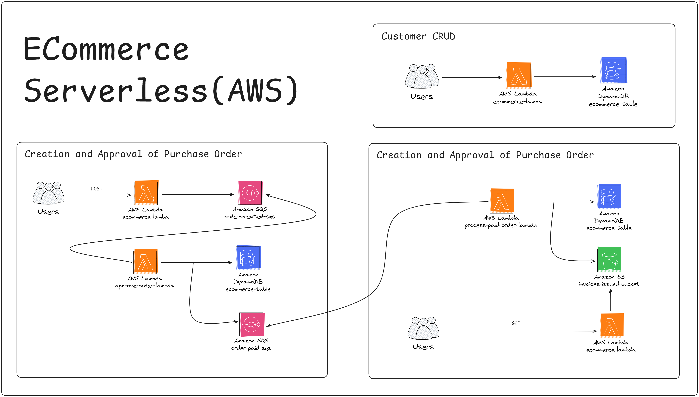

# Ecommerce Serverless Application

This repository contains a serverless Ecommerce application built using AWS services. The application is designed to handle client management, purchase order creation, approval processes, and invoice retrieval. The architecture leverages AWS Lambda, AWS DynamoDB, AWS SQS, and AWS S3. Below is a detailed overview of the application's functionality.

## CRUD Client

The client can send HTTP requests to AWS Lambda functions to perform Create, Read, Update, and Delete (CRUD) operations. The information is stored and updated in an AWS DynamoDB table. The following HTTP protocols are supported:

- POST: Create a new client record.
- GET: Retrieve client information.
- PUT: Update existing client information.
- DELETE: Remove client records.

## Purchase Order Creation and Approval

1. Purchase Order Creation
   - The user sends a POST request to an Ecommerce Lambda function to create a purchase order.
   - The Lambda function sends the purchase order details to an AWS SQS queue.
2. Purchase Order Approval Worker
   - A Lambda function acts as a consumer (worker) of the SQS queue.
   - This worker contains logic to verify whether the purchase order is approved.
   - The result of the approval process is reflected in DynamoDB.
   - If the purchase order is approved, the worker sends a message to another SQS queue indicating that the order has been paid.
3. Paid Order Processing Worker
   - Another Lambda function acts as a consumer of the SQS queue for paid orders.
   - This worker processes the paid orders, storing the relevant information in DynamoDB.
   - The worker also generates an invoice file and stores it in an S3 bucket.

## Invoice Retrieval

- There is an additional route that passes through a Lambda function to retrieve invoices from the S3 bucket for a specific client.

## Application Flow

The image above represents the flow of the application, created using Excalidraw.

